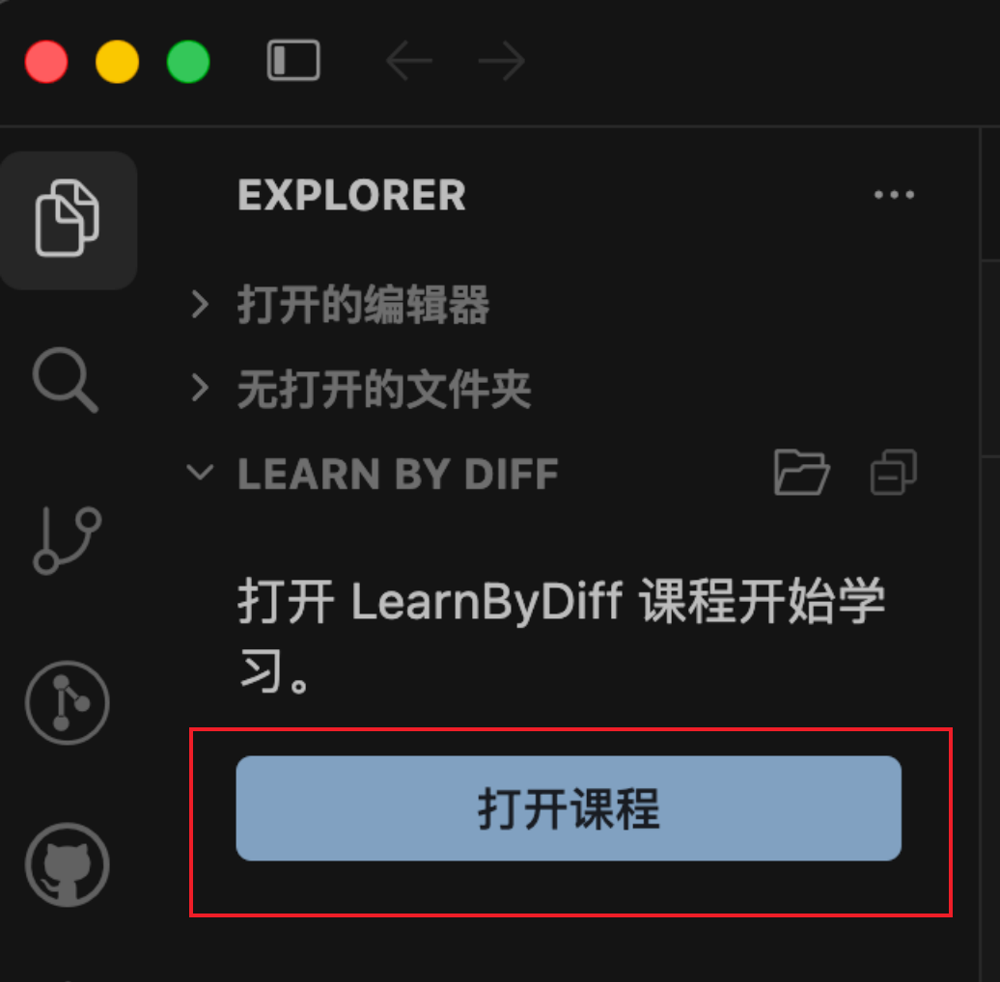

# はじめに

## インストール

LearnByDiff は **VS Code**、**Cursor**、その他の VS Code 系 IDE で使えます。

拡張機能ビューで **LearnByDiff** を検索するか、次のマーケットから開きます。

- [Visual Studio Marketplace](https://marketplace.visualstudio.com/items?itemName=RuanJiazhen.learn-by-diff)（VS Code）
- [Open VSX](https://open-vsx.org/extension/RuanJiazhen/learn-by-diff)（Cursor およびその他の Open VSX 系 IDE）

[手動インストール](https://github.com/RJiazhen/learn-by-diff/releases/tag/v0.1.0)もできます。リリースページから `.vsix` をダウンロードし、拡張機能ビューにドロップしてください。

## コースを開く

Explorer の **LEARN BY DIFF** ビューのタイトルバーで「コースを開く」をクリックします（またはコマンドパレットで **LearnByDiff: コースを開く**）。



次のデモコース設定 URL を貼り付けて確定します。

```text
https://github.com/RJiazhen/learn-by-diff/blob/main/examples/demo-course/.course-config/course.yml
```

フォルダー選択で学習ワークスペースの保存先を選びます。コース関連ファイルはそのディレクトリにダウンロードされます。

<image src="../../images/demo-course-screenshot.png" alt="demo course screenshot" style="height: 500px; width: auto; margin: 0 auto;" />

> ダウンロード後の学習ワークスペース構成

対応 IDE では、次のリンクからワンクリックで開けます。

- [VS Code](vscode://RuanJiazhen.learn-by-diff/open?url=https://github.com/RJiazhen/learn-by-diff/blob/main/examples/demo-course/.course-config/course.yml)
- [Cursor](cursor://RuanJiazhen.learn-by-diff/open?url=https://github.com/RJiazhen/learn-by-diff/blob/main/examples/demo-course/.course-config/course.yml)

## 自分のやり方で学ぶ

コースを初めて開くと、第 1 章の開始スナップショットがローカルに展開されます。

デモコースでは [Live Preview](https://marketplace.visualstudio.com/items?itemName=ms-vscode.live-server) 拡張で `index.html` をプレビューできます。

章の「完了」をクリックすると、ローカルのコードがその章の完了スナップショットに置き換わり、完成形を確認できます。

<video class="lbd-loop-video" src="../../video/change-chapter.mp4" autoplay muted loop playsinline></video>

「ドキュメント」ボタンで、その章の内容と学習目標を読めます。

<video class="lbd-loop-video" src="../../video/open-documents.mp4" autoplay muted loop playsinline></video>

章の中のファイルをクリックすると、目標に到達するためのコード変更を確認できます。

<video class="lbd-loop-video" src="../../video/open-file.mp4" autoplay muted loop playsinline></video>

章フォルダーを単独で開いて比較したり、未開始に戻したりする操作は [機能](/ja/intro/features) を参照してください。
