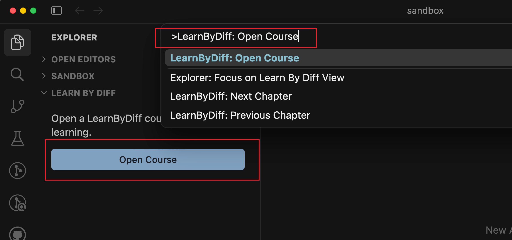
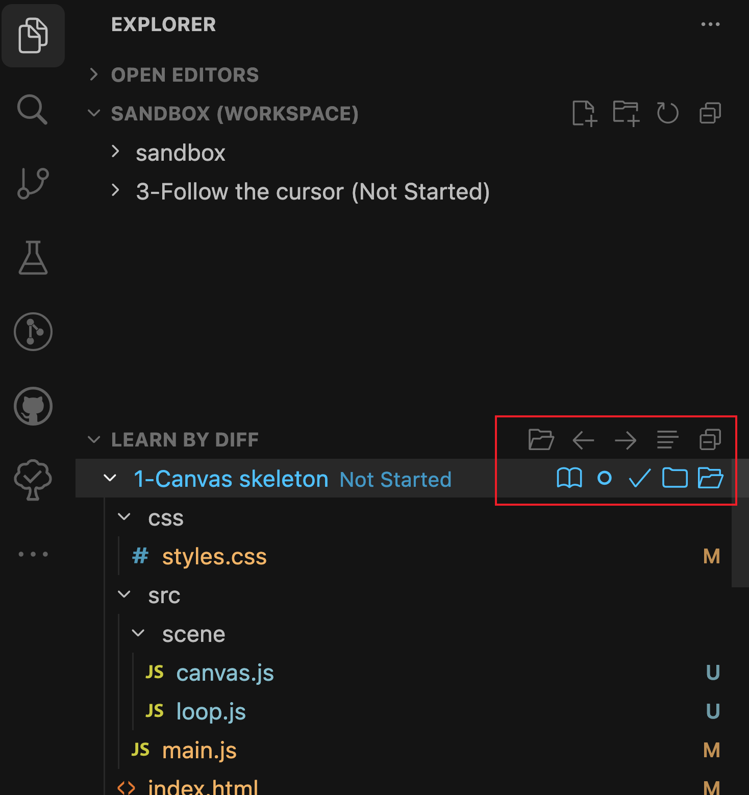
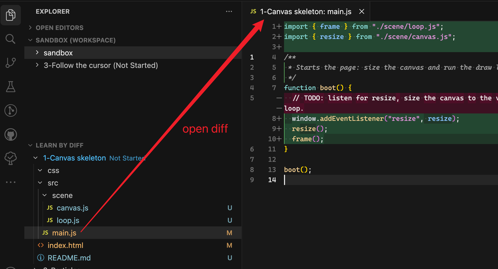
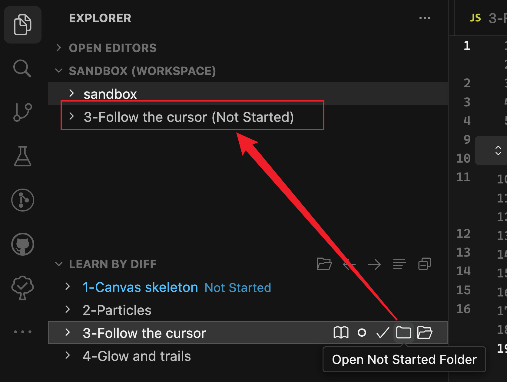

# 功能

## 打开课程

如果当前打开的工作区中没有课程，则可以点击 **「打开课程」** 按钮，或者在命令面板中搜索并使用 **「Learn By Diff: Open Course」** 命令。

然后在弹出的输入框中输入课程配置文件的 URL，然后点击 **「确定」** 按钮，即可打开课程。

## 章节切换与查看

在打开课程后，可以看到 Explorer 视图中出现 **Learn By Diff** 栏位，其中会罗列当前工作区对应的课程章节列表。

在 Learn By Diff 栏位中，提供了以下切换章节相关操作按钮：

| 操作                | 作用                     |
| ------------------- | ------------------------ |
| **上一章 / 下一章** | 切换到相邻章节的初始状态 |
| **打开章节文档**    | 打开该章节的课程文档     |
| **未开始**          | 切换到该章节的未开始状态 |
| **已完成**          | 切换到该章节的已完成状态 |

注意，你可以随时修改当前文件夹中的代码，而切换章节时，会提示**是否覆盖当前文件夹中的代码**。

## 文件对比

在 Learn By Diff 栏位中，可以展开章节，查看该章节的变更列表，和源代码视图一样，可以点击文件名并查看对应的文件对比。

## 章节对比

有时候需要将不同章节的不同完成状态的代码进行运行对比，这时候就可以点击章节名称右侧的 **「打开未开始文件夹」** 或 **「打开已完成文件夹」** 按钮。这时，对应的代码会被下载到本地，并作为一个单独的文件夹添加到工作区。

