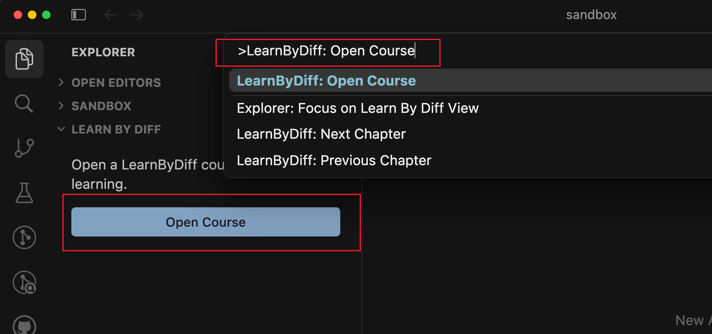
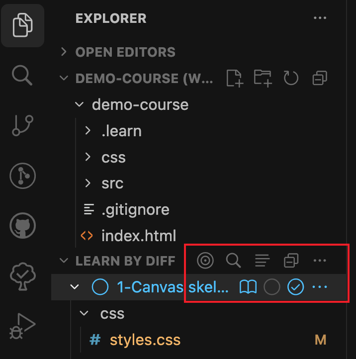
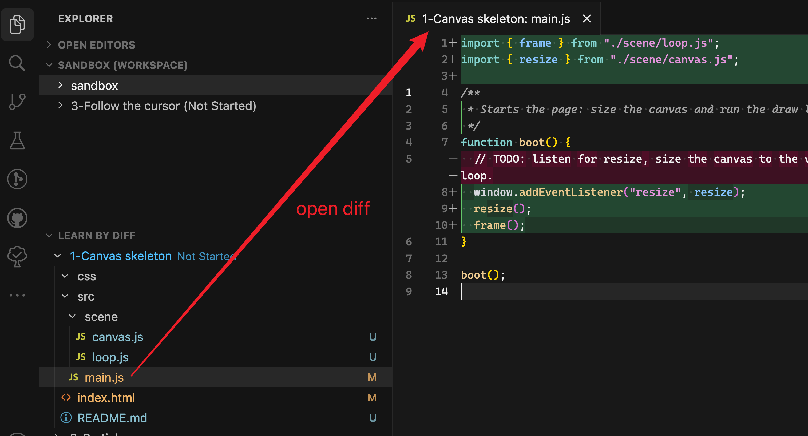
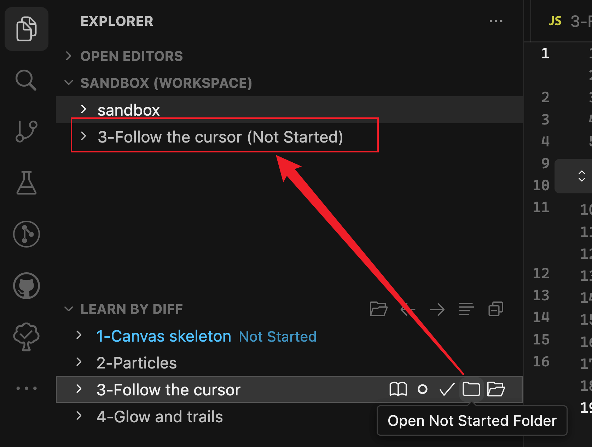

# 功能

## 打开课程

如果当前打开的工作区中没有课程，则可以点击 **「打开课程」** 按钮，或者在命令面板中搜索并使用 **「Learn By Diff: Open Course」** 命令。

在列表中点选一门官方课程即可打开。也可以在输入框中填入 course.jsonc 路径或 URL 并确认。

## 章节切换与查看

在打开课程后，可以看到 Explorer 视图中出现 **Learn By Diff** 栏位，其中会罗列当前工作区对应的课程章节列表。

在 Learn By Diff 视图中，你可以点击按钮进行以下操作：

| 操作                    | 作用                                         |
| ----------------------- | -------------------------------------------- |
| **滚动到当前章节**      | 定位当前章节                                 |
| **搜索章节**            | 按标题或 ID 查找并定位章节，支持模糊搜索     |
| **打开章节文档**        | 打开该章节的课程文档                         |
| **未开始** / **已完成** | 将工作区代码切换为该章节的未开始或已完成快照 |

注意，当你切换快照时，会提示**是否覆盖当前文件夹中的代码**，以防止误操作。

## 文件对比

在 Learn By Diff 栏位中，可以展开章节，查看该章节的变更列表，和源代码视图一样，可以点击文件名并查看对应的文件对比。

## 章节对比

有时候需要将不同章节的不同完成状态的代码进行运行对比，这时候就可以点击章节上的 **「...」** 按钮，再选择 **「打开未开始文件夹」** 或 **「打开已完成文件夹」**。这时，对应的代码会被下载到本地，并作为一个单独的文件夹添加到工作区。

