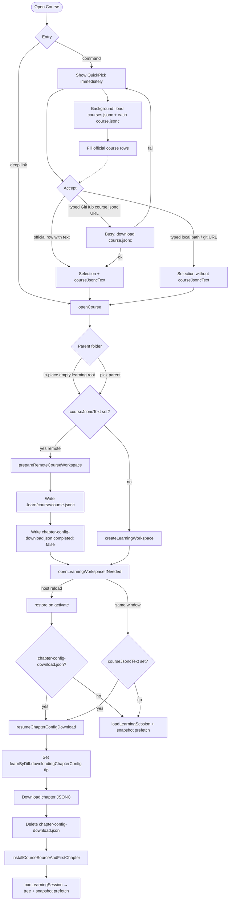

# Architecture & development process

Companion to [`AGENTS.md`](../AGENTS.md). Describes how LearnByDiff is structured today and how we have been evolving it.

## Problem model

1. **Course repository** — declares pedagogy in a `course.jsonc` file (often at the repo root or under `.course-config/`; not the student’s full solution tree).
2. **Source repository** — holds **directory snapshots** (`fromDir` → `toDir` per chapter), optionally under `source.root`.
3. **Learning workspace** — student folder created by the extension; owns `.learn/` runtime state and the editable working tree.

Learning is driven by **snapshot diffs**, not `git checkout` of chapter history.

## Monorepo boundaries

```text
course.jsonc / chapters/*.jsonc
        │
        ▼
@learn-by-diff/protocol   parse → defaults → validate → Course
        │
        ▼
learn-by-diff extension   clone/mirror source → export trees → UI / URI
```

- **Protocol** has no VS Code or git dependency. Safe for skills, CI, and schema consumers.
- **Extension** owns git CLI, filesystem materialization, TreeView, commands, URI handler.
- After changing protocol `src/`, always `vp run @learn-by-diff/protocol#pack` before extension tests or F5.

## Learning Course Protocol (LCP) today

### On disk

```text
course.jsonc                      # Open Course takes this file
chapters/*.jsonc                # default chaptersDir

# or

.course-config/course.jsonc
.course-config/chapters/*.jsonc # sort order = course order
```

`chaptersDir` in `course.jsonc` may point at another directory next to `course.jsonc` (nested paths allowed; no `..`).

### `course.jsonc` (all optional)

| Field               | Default                                                       |
| ------------------- | ------------------------------------------------------------- |
| `id`                | Course home folder; `{repo}-learn` if that home is a git root |
| `title`             | `id`                                                          |
| `source.repository` | `.` (directory that contains `course.jsonc`)                  |
| `source.root`       | none                                                          |
| `chaptersDir`       | `chapters` (directory next to `course.jsonc`)                 |

No `protocolVersion`, no `workspace` block.

### Chapter JSONC (all optional)

| Field               | Default                                                                             |
| ------------------- | ----------------------------------------------------------------------------------- |
| `id`                | Filename without numeric prefix                                                     |
| `title`             | `id`                                                                                |
| `fromDir` / `toDir` | `""` (empty tree)                                                                   |
| `entryFiles`        | Discover all files under `toDir` at runtime                                         |
| `docs`              | none — `http(s)` URL or path relative to chapter snapshot (`toDir`, then `fromDir`) |
| `changedFiles`      | omitted — classify from/to at runtime; `[]` means unchanged                         |

Wire editors with:

```jsonc
{
  "$schema": "<rel>/packages/protocol/schema.json#/$defs/chapter",
}
```

## Extension runtime (`.learn/`)

Under a learning workspace root:

| Path                                     | Purpose                                                                            |
| ---------------------------------------- | ---------------------------------------------------------------------------------- |
| `.learn/progress.json`                   | Applied chapter id / start or finish snapshot                                      |
| `.learn/course/`                         | Copy of course config                                                              |
| `.learn/origin.json`                     | Open Course origin for copy-link (gitignored)                                      |
| `.learn/chapter-config-download.json`    | Present only while remote chapter JSONC is not downloaded yet; deleted when done   |
| `.learn/source.git/`                     | Materialized source store (mirror)                                                 |
| `.learn/snapshots/dirs/<source-dir>/`    | Cached source trees (one copy per unique `fromDir`/`toDir`; prefetched after open) |
| `.learn/refs/<ordinal>-<title> (status)` | Runnable copy; folder name matches Explorer                                        |
| `{root}.code-workspace`                  | Multi-root window (named after the course dir)                                     |

Activation today: `onUri` + `onView:learnByDiff.courseView` + `workspaceContains:.learn/progress.json`. Explorer view **Learn By Diff** is always shown; `viewsWelcome` + Open Course in the view More Actions menu when the folder is not a learning workspace.

### Open Course process

Entry points: command `learnByDiff.openCourse` (picker) and URI handler `vscode://` / `cursor://` → `openCourse`.



Notes:

- The picker stays busy until remote **`course.jsonc`** downloads finish (catalog rows and a typed GitHub file URL). **Chapter JSONC is not** part of that wait.
- Official catalog: [`RJiazhen/learn-by-diff-courses`](https://github.com/RJiazhen/learn-by-diff-courses) `courses.jsonc` on `main`. Catalog failure still allows a typed path or URL.
- Remote prepare writes `.learn/chapter-config-download.json` (`completed: false`). After the workspace is open, resume downloads chapter JSONC, deletes that file, then materializes source and chapter 1. That download shows status-bar progress (`ProgressLocation.Window`). The Learn By Diff view tip uses context `learnByDiff.downloadingChapterConfig`.
- Local / full clone path uses `createLearningWorkspace` (course + chapters + source + chapter 1) before the folder opens; snapshot trees still prefetch in the background afterward.

**Not Started** / **Completed** export that chapter’s `fromDir` or `toDir` into the student tree and mark the row with that status (QuickPick only when the tree differs from the last applied snapshot).

On the **current** chapter only, the button that already matches that status is disabled until the student tree differs from the applied snapshot. Not Started (`contextValue` `chapter-start` / `chapter-start-docs`) disables `applyChapterStart`. Completed (`chapter-finish` / `chapter-finish-docs`) disables `applyChapterFinish`. The other status button stays enabled, so a clean tree can still switch status; after the switch, the newly matching button is the one disabled. Other chapter rows stay `chapter` / `chapter-docs`, so both of their buttons stay enabled. `enablement` greys the command out; it does not hide it. `learnByDiff.studentHasEdits` is set from `sessionHasStudentEdits` (same compare as the dirty confirm: current side’s `fromDir` or `toDir`, ignoring `.git`, `.learn`, gitignored paths, and `retain`). The check runs when the session is applied and again, debounced, after workspace file changes outside `.git`, `.learn`, and `node_modules`. A failed compare leaves the flag false, so the matching button stays disabled.

View More Actions holds Open Course, previous/next chapter, and both copy-URL commands. Previous/next apply the adjacent chapter’s start. Title-bar search opens a QuickPick and reveals the chapter (does not apply a snapshot). The current chapter shows the Not Started (`circle-large`) or Completed (`pass`) action icon in front of the title. The status words are only in that row’s tooltip. Open Not Started Folder and Open Completed Folder live in the chapter More menu. First open still exports chapter one’s `fromDir`, then opens the learning workspace. Unique source snapshot directories (shared when chapters reuse the same `fromDir`/`toDir`) are cached in the background after the folder is open. Reopening a learning workspace only shows that status-bar progress if snapshots are still missing. Later Start/Finish, diffs, and reference folders copy from `.learn/snapshots` instead of `git archive`. Opening a course loads `{course-dir}.code-workspace` at the learning root (student tree only at first) so later **Open Not Started Folder** / **Open Completed Folder** append chapter copies as extra roots without restarting the host, and File → Open Recent can reopen that workspace with those folders. Copies live under `.learn/refs/` as `01-Title (Not Started)` (gitignored).

## Major surfaces

| Area                                  | Responsibility                                                                               |
| ------------------------------------- | -------------------------------------------------------------------------------------------- |
| `workspace/openCourse.ts`             | Shared open-course flow (command + deep link)                                                |
| `workspace/officialCourses.ts`        | Official `courses.jsonc` catalog; each row’s `course.jsonc` fills the Open Course list       |
| `workspace/creator.ts`                | Create learning root, copy config, materialize source, first chapter                         |
| `workspace/sourceStore.ts`            | Source mirror (git or tree copy); list/read/export chapter subtrees                          |
| `workspace/session.ts`                | Chapter navigation and snapshot apply                                                        |
| `snapshot/archive.ts` / `prefetch.ts` | Unique source trees; prefetch in the background after Open Course (and on reopen if missing) |
| `ui/explorerView.ts`                  | SCM-like chapter/file tree from cached snapshots; contextValues, inline actions              |
| `ui/diff.ts` / `openDocs.ts`          | File diffs (`.learn/snapshots`, warmed after open); docs URL / Markdown / file               |
| `uri/*`                               | `vscode://RuanJiazhen.learn-by-diff/open?url=…` (also `cursor://`)                           |
| Copy URL commands                     | Current-course Open Course input; workspace `course.jsonc` scan; one one-click URI at a time |

Deep link authority = `publisher.name` → `RuanJiazhen.learn-by-diff`.

## Development loop (as practiced)

1. Change protocol and/or extension; keep doc comments on every function.
2. `vp check` + package tests; pack protocol if needed.
3. F5 against `sandbox/` + `examples/demo-*`; reload host after rebuild.
4. Update `schema.json`, fixtures, demo JSONC, and skill docs when the protocol surface changes.
5. Commit with Conventional Commits, **split by logical change** (protocol → extension → examples → docs).

## Author skills

`skills/generate-course-config` scaffolds `.course-config` from snapshot dirs. Not part of pnpm. After generate, print a local try-open deep link and the absolute `course.jsonc` path.

## Examples

- `examples/demo-course` — course config (git URL + `source.root: examples/demo-source`, chapter `docs` samples: https tutorial, Markdown, PDF).
- `examples/demo-source` — `start` / `skeleton` / `particles` / `follow` / `glow` snapshots (canvas particles that follow the cursor).
- `apps/website` — VitePress docs site (`https://rjiazhen.github.io/learn-by-diff/`).

## Related docs

- Human README (English, Marketplace): [`../README.md`](../README.md); locales: [`README.zh-cn.md`](README.zh-cn.md), [`README.zh-tw.md`](README.zh-tw.md), [`README.ja.md`](README.ja.md)
- Contributing / publish: [`../CONTRIBUTING.md`](../CONTRIBUTING.md), [`../AGENTS.md`](../AGENTS.md)
- Skill install/use: [`../skills/README.md`](../skills/README.md)
